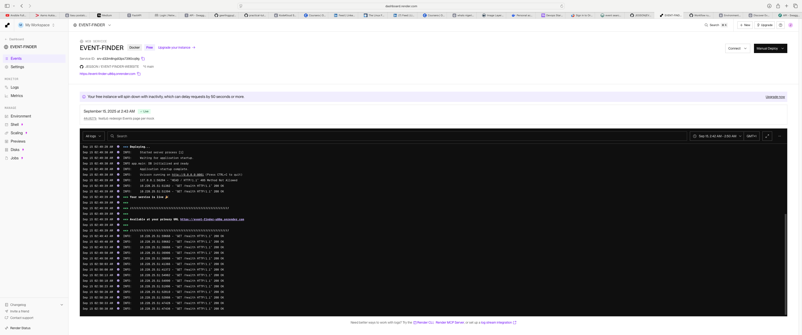

# Event Finder

A simple, scalable Event Finder with a FastAPI backend and a static HTML/CSS/JS frontend.

## Live Demo

- Frontend on Render: <https://event-finder-website.onrender.com/index.html>

## Screenshots (Render)

<!-- Add your screenshots to docs/screenshots and they will render here. -->

<p align="center">
  
</p>

<p align="center">
  <a href="https://event-finder-website.onrender.com/index.html">
    
  </a>
</p>

To update these images:

```bash
mkdir -p docs/screenshots
# Save your images to the paths below
# - docs/screenshots/render-backend.png
# - docs/screenshots/render-frontend.png
git add docs/screenshots/*.png
git commit -m "docs: add Render screenshots"
git push origin main
```

## Features

- Add events (title, description, location, category, date)
- Search events by keyword, location, date, category
- Pagination (limit/offset) with total count header
- Event details page
- SQLite storage with helpful indexes

## Run

Backend (port 8001):

```bash
python3 -m venv .venv
source .venv/bin/activate
pip install -r requirements.txt
uvicorn app.main:app --host 127.0.0.1 --port 8001 --reload
```

Frontend (port 8000):

```bash
python3 -m http.server 8000
```

Open [http://localhost:8000/](http://localhost:8000/)

## API

- `POST /api/events` (create)
- `GET /api/events` (search) — params: `q, location, date, category, start_date, end_date, limit, offset, sort`
- `GET /api/events/{id}` (by id)
- `PATCH /api/events/{id}` (partial update)
- `DELETE /api/events/{id}` (delete)
- `GET /api/meta/categories` (category list)

The search response includes `X-Total-Count` header.

## Seed Data

With the backend virtualenv active:

```bash
python scripts/seed.py
```

## Architecture

- Backend: FastAPI + SQLite (via `sqlite3`).
- Layers:
  - `app/core`: settings and database helpers.
  - `app/schemas`: Pydantic models and enums.
  - `app/repositories`: SQL and data access helpers.
  - `app/api/routes`: HTTP route handlers.
  - `scripts/`: utilities like the DB seeder.
- Frontend: Static pages (`index.html`, `events.html`, `event-detail.html`, `about.html`) that call the API via `fetch`.
- Styling: Layered CSS (`assets/css`): `base`, `layout`, `components`, `theme`, `utilities` composed by `main.css`.

See [docs/ARCHITECTURE.md](docs/ARCHITECTURE.md) and [docs/API.md](docs/API.md) for details.

## Configuration

Environment variables (prefix `EVENTFINDER_`):

- `EVENTFINDER_DATABASE_PATH` (default `./event_finder.db`)
- `EVENTFINDER_APP_NAME` (optional)
- `EVENTFINDER_BACKEND_CORS_ORIGINS` (JSON list; optional)

Values can be provided via a `.env` file in the project root.

## Performance

- Keyword search uses SQLite FTS5 when available (falls back to `LIKE`).
- Helpful indexes are created for `date`, `created_at`, `LOWER(title)`, `LOWER(location)`, and `LOWER(category)`.
